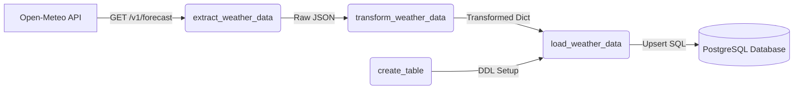

# ETL Weather Data Pipeline using Apache Airflow & PostgreSQL

An automated end-to-end Data Pipeline built with **Apache Airflow (TaskFlow API)**, **Open-Meteo REST API**, and **PostgreSQL**. The pipeline extracts real-time weather metrics, transforms the JSON response, and loads/upserts the structured records into a PostgreSQL database.

---

## Architecture & Pipeline Workflow



### Pipeline Tasks (`etl_weather` DAG):
1. **`create_table`**: Ensures the target database table `weather_data` exists in PostgreSQL with appropriate data types and primary keys.
2. **`extract_weather_data`**: Queries the Open-Meteo REST API using `HttpHook` to retrieve current weather metrics (temperature, wind speed, wind direction, weather code).
3. **`transform_weather_data`**: Cleans, extracts, and formats the target fields into a clean dictionary structure.
4. **`load_weather_data`**: Executes an idempotent `INSERT INTO ... ON CONFLICT (time) DO UPDATE` query via `PostgresHook` to persist the data without duplicating records.

---

## 🛠️ Tech Stack & Prerequisites

* **Orchestration:** Apache Airflow 3 (TaskFlow API)
* **Environment:** Astro CLI / Docker Desktop
* **Database:** PostgreSQL
* **API:** Open-Meteo Free Forecast API
* **Language:** Python 3.14

---

## 📁 Project Structure

```text
.
├── dags/
│   └── etlweather.py             # Main Airflow DAG definition file
├── .astro/                       # Astro CLI project configuration
├── airflow_settings.yaml         # Pre-configured connections (open_meteo_api & postgres_default)
├── docker-compose.override.yml   # Custom Docker port mapping (Postgres port 5433 fallback)
├── Dockerfile                    # Astro Runtime Docker container configuration
├── requirements.txt              # Required Python provider packages
└── README.md                     # Project documentation
```

---

## 🚀 Getting Started

### 1. Prerequisites
Ensure you have the following installed on your machine:
* [Docker Desktop](https://www.docker.com/products/docker-desktop/)
* [Astro CLI](https://www.astronomer.io/docs/astro/cli/install-cli)

### 2. Start the Airflow Environment
Clone the repository and run Astro CLI:

```bash
# Clone the repository
git clone <your-repository-url>
cd "ETL Weather Data Pipleine"

# Start Docker Desktop, then run:
astro dev start
```

### 3. Access Airflow Web UI
Once the containers are healthy, open your browser:
* **URL:** `http://localhost:8080`
* **Username:** `admin`
* **Password:** `admin`

---

## 🗄️ Database Schema & Data Inspection

### Database Table Schema (`weather_data`)

```sql
CREATE TABLE IF NOT EXISTS weather_data (
    latitude VARCHAR(20),
    longitude VARCHAR(20),
    temperature FLOAT,
    windspeed FLOAT,
    winddirection FLOAT,
    weathercode INT,
    time TIMESTAMP PRIMARY KEY
);
```

### Querying Stored Records
You can inspect the extracted records from PostgreSQL via terminal or any SQL client (DBeaver / pgAdmin):

```bash
docker exec -it etl-weather-data-pipleine_001ede-scheduler-1 python -c "import psycopg2; conn = psycopg2.connect(host='host.docker.internal', port=5432, user='postgres', password='postgres', dbname='postgres'); cur = conn.cursor(); cur.execute('SELECT * FROM weather_data;'); print(cur.fetchall())"
```

---

## ⚙️ Configuration & Customization

### Changing Location / Coordinates
To change the target location, update the coordinates in `dags/etlweather.py`:

```python
LATITUDE = "23.6850"   # Change latitude
LONGITUDE = "90.3563"  # Change longitude
```

### Schedule Interval
By default, the DAG runs once daily (`schedule='@daily'`). To switch to hourly updates:

```python
with DAG(
    dag_id='etl_weather',
    default_args=default_args,
    schedule='@hourly',    # Run at the start of every hour
    catchup=False,
) as dag:
```

---

## 📝 License
This project is open-source under the [MIT License](LICENSE).
